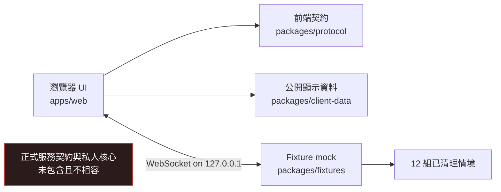

**語言：** **繁體中文** · [English](README.en.md)

# Darkforest: Reset Protocol — Web Client

**Darkforest: Reset Protocol** 的開源瀏覽器前端與本機展示版。


[Tokimi 官網](https://tokimi.space/) · [遊玩官方版本](https://darkforest.tw/) ·
[原始碼儲存庫](https://github.com/TokimiSpace/darkforest-web)


> [!IMPORTANT]
> 本儲存庫**只有前端與以 fixtures 驅動的本機展示版**，不包含正式配對伺服器、私人遊戲核心、正式服務
> contract、live operations、資料庫、部署祕密或未公開內容管線。這是 pre-alpha
> 軟體，不能視為可自行架設的完整官方遊戲。

## 包含內容

- Fresh/Preact 網頁殼層與瀏覽器遊戲 UI。
- 獨立且已清理的 public-demo schema 與 runtime parser（`packages/protocol`）；刻意不相容於正式服務
  contract。
- 手動整理的展示數值（`packages/client-data`），不含私人來源識別、未使用調參權重或規則引擎實作。
- 12 組已清理情境與只監聽 loopback 的 mock server（`packages/fixtures`）。
- UI、無障礙、協定與公開邊界檢查。
- 六種介面語言與版本化玩家展示文案：繁體中文、簡體中文、英文、日文、韓文與越南文。

瀏覽器原始碼也保留 synthetic 的排隊與觀戰展示狀態，讓貢獻者能檢視這些前端概念。本機 fixture server
不會送出或執行這些狀態；它們不構成配對服務、帳號／session 實作或正式服務 contract。

正式配對、權威結算、防作弊、持久化、管理後台、分析及 live-service
整合都不在本儲存庫內。完整範圍請讀[公開範圍](docs/PUBLIC_SCOPE.md)。

這裡開源的工具，是獨立貢獻者重建與驗證此「前端 demo」所必需的部分：client emitter、build、
鎖定相依版本、本機 fixtures、瀏覽器與無障礙 QA、素材驗證及發布檢查。正式部署、營運、平衡、
反作弊、分析與內容製作工具仍維持私有。

## 架構概覽



本機展示版不會連線至 `darkforest.tw` 或其他正式端點。下游服務必須明確實作本 repo 的 public-demo
schema，或自行提供 adapter；這不代表與正式服務相容。請先閱讀[架構](docs/ARCHITECTURE.md)及
[前端契約](docs/CLIENT_CONTRACT.md)。

## 快速開始

安裝 [Deno](https://docs.deno.com/runtime/getting_started/installation/) 並複製儲存庫：

```sh
git clone https://github.com/TokimiSpace/darkforest-web.git
cd darkforest-web
```

在第一個終端機啟動 loopback fixture server：

```sh
deno task mock
```

在第二個終端機啟動網頁程式：

```sh
deno task dev
```

開啟 `http://localhost:8000`。預設 fixture 端點為 `ws://127.0.0.1:8788/ws?fixture=openingMegaCity`。

執行本機品質門檻：

```sh
deno task check
deno task test
deno task build
deno task ci
```

命令只應使用 workspace task 宣告的權限；授予更廣泛的 Deno 權限前，請先檢查 task 內容。

## 這是 public-demo schema，不是遊戲伺服器

Protocol package 描述本儲存庫瀏覽器與本機 fixture 使用的訊息；它是獨立的 public-demo
v1，並非擷取出的正式 protocol
版本。它不公開權威驗證、遊戲結算、配對、持久化、管理或濫用防護。Fixture server
是決定性的開發工具，不是正式服務參考實作，也不是安全邊界。

部分 message shapes 只用來呈現 synthetic 的產品概念狀態，包括排隊及等待觀戰介面；已提交的 fixture
flow 不會送出它們。保留這些前端 shapes，不代表包含對應服務、provider integration 或任何正式相容性。

目前契約仍屬 pre-alpha。破壞性變更會提高匯出的 protocol version，並記錄於本儲存庫
changelog。詳見[前端契約](docs/CLIENT_CONTRACT.md)。

## 素材與專案識別

只有具備核准來源紀錄的 demo 素材可以進入儲存庫。本 repo 包含一份已授權的玩家展示文案
snapshot；未公開內容庫、正式美術、原始美術來源、衍生自宣傳影片的內容、第三方 NFT／品牌
媒體及未審核外部素材均排除。每個可發布素材都必須列入經審核的 registry 與生成 manifest，並記錄
SHA-256
與權利狀態。請閱讀[素材來源](docs/ASSET_PROVENANCE.md)和[AI 輔助內容](docs/AI_ASSISTED_CONTENT.md)。

軟體授權不允許把 fork 表示成 Tokimi 或 Darkforest 官方版本。詳見[專案識別](TRADEMARKS.md)。

## 安全與隱私

- 請透過
  [GitHub Security Advisories](https://github.com/TokimiSpace/darkforest-web/security/advisories/new)
  私下回報漏洞；請勿公開尚未修補的問題。
- 未經明確授權，不要測試 `darkforest.tw` 或其他正式服務。
- 本機展示版設計為不需要正式憑證、分析服務或玩家帳號。
- 正式服務整合仍需另外設計認證、Content Security Policy、隱私審查、rate limiting 及伺服端授權。

請閱讀[安全政策](SECURITY.md)、[隱私邊界](docs/PRIVACY.md)和[已知限制](docs/KNOWN_LIMITATIONS.md)。

## 參與貢獻

歡迎 issue 與 pull
request。請先閱讀[貢獻指南](CONTRIBUTING.md)及[行為準則](CODE_OF_CONDUCT.md)。貢獻必須留在公開邊界內；涉及測試、無障礙、安全或素材時，也要附上相應證據。

## 授權

本儲存庫依路徑採多重授權：

- 軟體、protocol types、build configuration、測試、CI 與工具：**Apache-2.0**；
- 語系目錄：**Apache-2.0 OR CC BY 4.0**；
- 經核准的文件、fixture 敘事與非品牌 demo 內容：**CC BY 4.0**；
- 第三方內容：沿用自身授權及姓名標示要求，且必須先明確核准並列入 manifest。

權威範圍請見
[LICENSES.md](LICENSES.md)，商業使用邊界請見[商業使用](docs/COMMERCIAL_USE.md)，相依套件與姓名標示政策請見
[THIRD_PARTY_NOTICES.md](THIRD_PARTY_NOTICES.md)，專案識別邊界請見 [TRADEMARKS.md](TRADEMARKS.md)。
