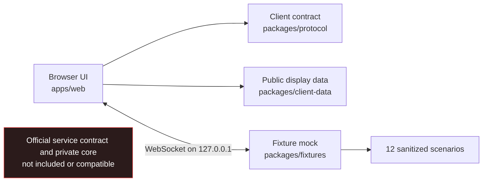

**Language:** **English** · [繁體中文](README.zh-TW.md)

# Darkforest: Reset Protocol — Web Client

The open-source browser client and local demo for **Darkforest: Reset Protocol**.


[Tokimi](https://tokimi.space/) · [Play the official game](https://darkforest.tw/) ·
[Source repository](https://github.com/TokimiSpace/darkforest-web)


> [!IMPORTANT]
> This repository contains the **frontend and a local, fixture-driven demo only**. It does not
> contain the production match server, private game core, official service contract, live
> operations, databases, deployment secrets, or unreleased content pipeline. It is pre-alpha
> software and is not a self-hostable copy of the official game.

## What is here

- The Fresh/Preact web shell and browser gameplay UI.
- A standalone, sanitized public-demo schema and runtime parser (`packages/protocol`), intentionally
  not compatible with the production service contract.
- Manually curated presentation values (`packages/client-data`) without private source lineage,
  unused tuning weights, or rule-engine implementation.
- Twelve sanitized scenarios and a loopback-only mock server (`packages/fixtures`).
- UI, accessibility, protocol, and publication-boundary checks.
- Six interface locales and a versioned player-facing demo-copy snapshot: Traditional Chinese,
  Simplified Chinese, English, Japanese, Korean, and Vietnamese.

The browser source also retains synthetic queue and spectator presentation states so contributors
can inspect those frontend concepts. The local fixture server does not emit or operate those states,
and they are not matchmaking, an account/session implementation, or a production-service contract.

Production matchmaking, authoritative resolution, anti-cheat controls, persistence, administration,
analytics, and live-service integrations remain outside this repository. See
[Public scope](docs/PUBLIC_SCOPE.md) for the complete boundary.

The tools included here are the tools an independent contributor needs to rebuild and verify the
declared frontend demo: emitter, build, frozen dependencies, local fixtures, browser QA,
accessibility checks, asset verification, and publication checks. Production deployment, operations,
balance, anti-cheat, analytics, and content-authoring tools stay private.

## Architecture at a glance



The local demo does not contact `darkforest.tw` or another production endpoint. A downstream service
must explicitly implement this repository's public-demo schema or provide its own adapter; that does
not create compatibility with the official service. Read [Architecture](docs/ARCHITECTURE.md) and
[Client contract](docs/CLIENT_CONTRACT.md) first.

## Quick start

Install [Deno](https://docs.deno.com/runtime/getting_started/installation/) and clone the
repository:

```sh
git clone https://github.com/TokimiSpace/darkforest-web.git
cd darkforest-web
```

Start the loopback fixture server in one terminal:

```sh
deno task mock
```

Start the web app in a second terminal:

```sh
deno task dev
```

Open `http://localhost:8000`. The default fixture endpoint is
`ws://127.0.0.1:8788/ws?fixture=openingMegaCity`.

Run the local quality gates:

```sh
deno task check
deno task test
deno task build
deno task ci
```

Commands run with the permissions declared by the workspace tasks. Review a task before granting
wider Deno permissions.

## Public-demo schema, not a game server

The protocol package describes messages used by this repository's browser and local fixtures. It is
public-demo v1, not an extracted production version. It does not publish authoritative validation,
game resolution, matchmaking, persistence, moderation, or abuse prevention. The fixture server is
deterministic development support—not a reference implementation or security boundary.

Some message shapes exist only to render synthetic product-concept states in the client, including
queue and spectator-waiting surfaces. The committed fixture flow does not send them. Their presence
does not imply that a corresponding service, provider integration, or official compatibility is
included.

The contract is currently pre-alpha. Breaking changes increment its exported protocol version and
are recorded in this repository's changelog. See [Client contract](docs/CLIENT_CONTRACT.md).

## Assets and project identity

Only demo assets with an approved provenance record may be committed. A curated, licensed
player-facing copy snapshot is included; unreleased authored content libraries, production artwork,
raw source art, promotional-video-derived material, third-party NFT/branded media, and unreviewed
external material are excluded. Every distributable asset must be listed in the reviewed registry
and its generated manifest with a SHA-256 hash, publication status, and license. See
[Asset provenance](docs/ASSET_PROVENANCE.md) and [AI-assisted content](docs/AI_ASSISTED_CONTENT.md).

The software license does not grant permission to present a fork as an official Tokimi or Darkforest
release. See [Project identity](TRADEMARKS.md).

## Security and privacy

- Report vulnerabilities privately through
  [GitHub Security Advisories](https://github.com/TokimiSpace/darkforest-web/security/advisories/new);
  do not disclose an unpatched issue publicly.
- Do not test `darkforest.tw` or any production service without explicit authorization.
- The local demo is designed to run without production credentials, analytics, or a user account.
- A production integration needs its own authentication design, Content Security Policy, privacy
  review, rate limiting, and server-side authorization.

Read [Security policy](SECURITY.md), [Privacy boundary](docs/PRIVACY.md), and
[Known limitations](docs/KNOWN_LIMITATIONS.md).

## Contributing

Issues and pull requests are welcome. Start with [CONTRIBUTING.md](CONTRIBUTING.md) and the
[Code of Conduct](CODE_OF_CONDUCT.md). Contributions must stay inside the public boundary and
include evidence for tests, accessibility, security, and asset provenance when applicable.

## Licensing

This is a path-specific multi-license repository:

- software, protocol types, build configuration, tests, CI, and tooling: **Apache-2.0**;
- locale catalogs: **Apache-2.0 OR CC BY 4.0**;
- approved documentation, fixture narrative, and non-brand demo content: **CC BY 4.0**;
- third-party material: its own license and attribution, and only when explicitly approved in the
  manifest.

See [LICENSES.md](LICENSES.md) for the authoritative scope, [Commercial use](docs/COMMERCIAL_USE.md)
for practical boundaries, [THIRD_PARTY_NOTICES.md](THIRD_PARTY_NOTICES.md) for dependency and
attribution policy, and [TRADEMARKS.md](TRADEMARKS.md) for the separate project-identity boundary.
