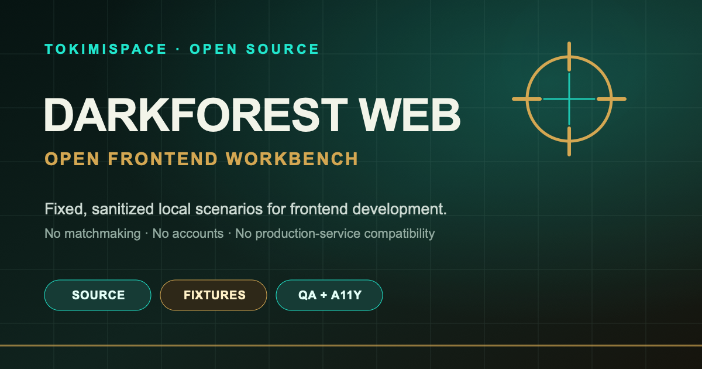
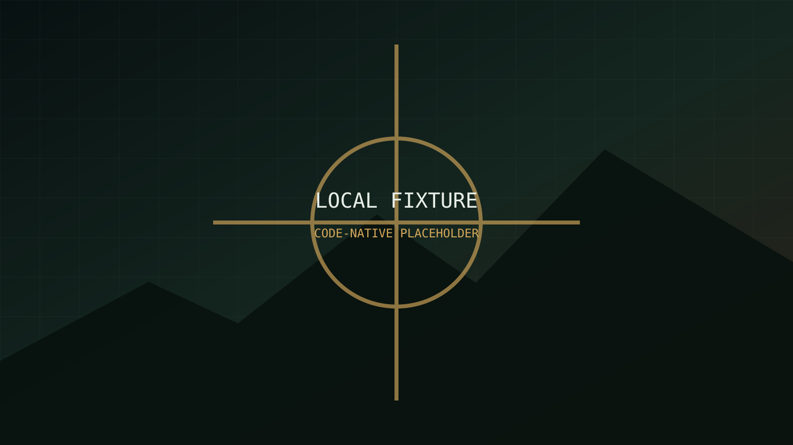
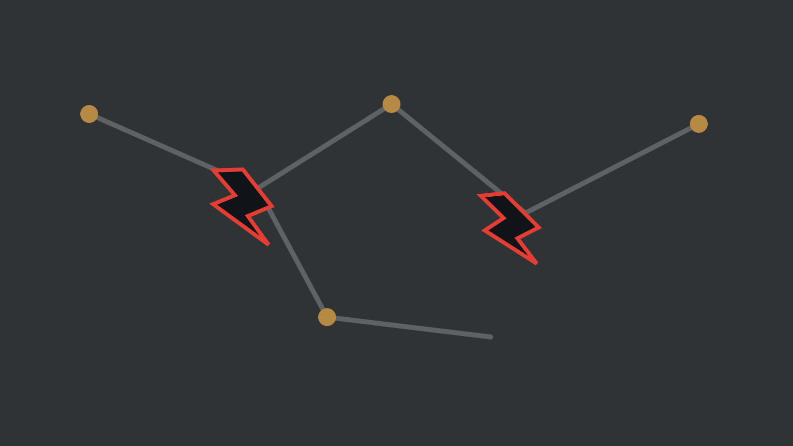
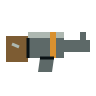
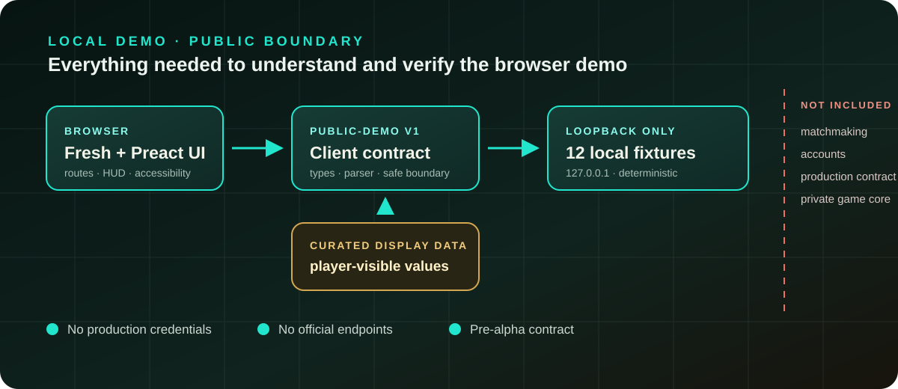

**語言：** **繁體中文（預設）** · [English](README.en.md)

# Darkforest: Reset Protocol — Web Client

**用 12 組已清理、可重現的本機情境，理解與改進 Darkforest 的瀏覽器遊戲介面。**



[Tokimi 官網](https://tokimi.space/) · [遊玩官方版本](https://darkforest.tw/) ·
[瀏覽開源專案](https://tokimi.space/open-source/) ·
[回報問題](https://github.com/TokimiSpace/darkforest-web/issues)


> [!IMPORTANT]
> 這是**開源前端與本機 fixture demo**，不是完整遊戲伺服器。正式配對、帳號、私人遊戲核心、
> 權威結算、資料庫、營運後台與正式服務 contract 均未開源，也未宣稱相容。本專案目前是
> pre-alpha，不應當成可自行架設的官方多人遊戲。

## 一眼看懂

| 你可以在這裡做什麼                                        | 這裡刻意沒有什麼                                 |
| --------------------------------------------------------- | ------------------------------------------------ |
| 啟動 Fresh/Preact 瀏覽器 UI                               | 正式配對、玩家帳號或 session                     |
| 用 12 組固定情境走查 HUD、戰鬥、商店、救援與終局畫面      | 私人 game core、規則引擎或正式平衡數值           |
| 檢查 public-demo v1 schema 與 runtime parser              | 正式服務 contract 或相容性承諾                   |
| 驗證六種語言、響應式版面、鍵盤操作、reduced motion 與 axe | 正式資料、replay、分析、反作弊或 live operations |
| 在不需要帳號、token 或正式端點的情況下貢獻前端            | production deployment、祕密或未公開內容管線      |

完整界線請看[公開範圍](docs/PUBLIC_SCOPE.md)與[已知限制](docs/KNOWN_LIMITATIONS.md)。

## 30 秒啟動本機 demo

先安裝 [Deno](https://docs.deno.com/runtime/getting_started/installation/)；專案 CI 固定使用 **Deno
2.5.6**。複製儲存庫後，開兩個終端機：

```sh
git clone https://github.com/TokimiSpace/darkforest-web.git
cd darkforest-web
```

**終端機 A — 啟動只監聽 loopback 的 fixture server：**

```sh
deno task mock
```

**終端機 B — 啟動網頁：**

```sh
deno task dev
```

打開
[http://localhost:8000/?fixture=openingMegaCity](http://localhost:8000/?fixture=openingMegaCity)。
相依套件已快取時，通常約 30 秒即可看到 demo；第一次執行會下載鎖定的相依套件，因此時間取決於網路。

本機資料流只有：

```text
瀏覽器 http://localhost:8000
   ↕ WebSocket
fixture ws://127.0.0.1:8788/ws?fixture=openingMegaCity
```

它不會默默連到 `darkforest.tw`、分析服務、遠端字型、翻譯服務或正式 API。Mock server
只適合本機開發，請勿公開到 Internet。

## 你會看到什麼

|                                                     本機情境畫面                                                      |                                            Reset 地圖狀態                                             |                                                                                 公開裝備素材                                                                                 |
| :-------------------------------------------------------------------------------------------------------------------: | :---------------------------------------------------------------------------------------------------: | :--------------------------------------------------------------------------------------------------------------------------------------------------------------------------: |
|  |  |   |
|                                       固定資料驅動的展示，不是 production 畫面                                        |                                        可檢查狀態轉換與可讀性                                         |                                                                   已列入 manifest 的 code-native demo 素材                                                                   |

前端包含大廳與 profile 草稿、戰術 HUD、迷霧與路徑、裝備／耐久、戰鬥預覽、倒地救援、商店、
Echo／Arbora 表現、終局、教學、紀錄介面、無障礙設定及 UI Lab。部分排隊與觀戰畫面只是 synthetic
的產品概念；fixture server 不會發送或操作那些狀態。

> [!NOTE]
> 上方素材是本 repo 核准的本機 demo 素材，不是正式美術包。正式美術、宣傳影片衍生內容、
> 未公開敘事庫及原始製作素材均未包含。

## 架構與信任邊界



瀏覽器、fixture server 與 `packages/protocol` 共用一套獨立的 public-demo v1 schema。每個 WebSocket
frame 都先通過有限度的結構 parser；這能改善不可信輸入的處理，但**不能**取代伺服端授權、
語意驗證、反作弊或正式安全設計。

任何其他服務若想接上此前端，都必須自行實作 public-demo schema 或 adapter。這不會產生對正式服務的
相容性。細節請讀[架構](docs/ARCHITECTURE.md)與[前端契約](docs/CLIENT_CONTRACT.md)。

## 12 組 fixtures、6 種語言

| 類別       | 固定情境                                                                                               |
| ---------- | ------------------------------------------------------------------------------------------------------ |
| 開場與操作 | `openingMegaCity`、`combatSkirmish`、`downedRescue`、`darkforestHazard`、`shopVisit`、`rejectionDrill` |
| 敘事與檢視 | `echoMode`、`legacyPrompt`、`replaySample`                                                             |
| 終局       | `finalReckoning`、`finalCovenant`、`finalAllDead`                                                      |

這些 fixtures 是 synthetic、deterministic 且已清理的 UI 範例，不是 production replay，也不重現私人
演算法。可在 mock server 首頁或 `http://127.0.0.1:8788/fixtures` 查看目前清單。

介面提供：

- 繁體中文 `zh-TW`（預設）
- 简体中文 `zh-CN`
- English `en`
- 日本語 `ja`
- 한국어 `ko`
- Tiếng Việt `vi`

六語文案是版本化的 public-demo snapshot，不代表正式服務一定使用相同文字、數值或內容。

## 專案地圖

| 路徑                    | 用途                                                        |
| ----------------------- | ----------------------------------------------------------- |
| `apps/web/`             | Fresh/Preact routes、瀏覽器 UI、樣式與六種語系              |
| `packages/protocol/`    | public-demo types、units 與 runtime parser                  |
| `packages/client-data/` | 僅供公開 UI 顯示的人工整理數值                              |
| `packages/fixtures/`    | 12 組已清理情境與 loopback-only mock server                 |
| `qa/game-e2e/`          | Playwright、axe、桌面／直向／橫向瀏覽器驗證                 |
| `scripts/`              | build、asset、publication boundary 與 generated-output 檢查 |
| `docs/`                 | 架構、隱私、授權、素材來源與公開範圍                        |

## 常用命令

| 命令              | 用途                                                   |
| ----------------- | ------------------------------------------------------ |
| `deno task mock`  | 在 `127.0.0.1:8788` 啟動固定 fixture server            |
| `deno task dev`   | 在 `localhost:8000` 啟動開發版網頁                     |
| `deno task check` | 格式、lint、型別、generated client 與測試              |
| `deno task test`  | 單元與 publication gate 測試                           |
| `deno task build` | 建立 production-mode 前端 bundle（不等於部署正式遊戲） |
| `deno task ci`    | 執行完整公開範圍品質門檻                               |

命令只應使用 workspace task 已宣告的 Deno 權限；授予更廣泛權限前，請先閱讀 `deno.json`。

若要執行獨立瀏覽器 QA：

```sh
cd qa/game-e2e
npm ci --ignore-scripts --omit=optional
npm audit --audit-level=high
npm test
```

QA 覆蓋 12 組 fixtures、六語、主要互動路徑、selected desktop／portrait／landscape viewports、
critical axe violations、reduced motion、水平溢位與非 loopback 請求阻擋。完整說明請看
[qa/game-e2e/README.md](qa/game-e2e/README.md)。

## 參與貢獻

1. 先閱讀[貢獻指南](CONTRIBUTING.md)、[公開範圍](docs/PUBLIC_SCOPE.md)與
   [行為準則](CODE_OF_CONDUCT.md)。
2. 選擇一個[公開 issue](https://github.com/TokimiSpace/darkforest-web/issues)，或先提出範圍清楚的建議。
3. 保持 local-first，不新增 production endpoint、私人來源、真實玩家資料或權利不明素材。
4. 提交前執行 `deno task ci`；UI 變更也請附上鍵盤、觸控、響應式與無障礙驗證結果。

Protocol、公開／私人界線、認證假設、授權或素材政策的變更，請先開 issue 與維護者討論。

## 安全、隱私與素材權利

- 漏洞請透過
  [GitHub Security Advisories](https://github.com/TokimiSpace/darkforest-web/security/advisories/new)
  私下回報；不要把未修補細節貼到公開 issue。
- 未經書面授權，不要測試 `darkforest.tw` 或其他正式服務。
- 本機 demo 不需要正式憑證、分析服務或玩家帳號；只在瀏覽器本機保留語言、profile 草稿、
  教學／輔助偏好、無障礙設定與有限的 session 提示狀態。詳見[隱私邊界](docs/PRIVACY.md)。
- 每個可發布素材都必須有來源、授權、SHA-256 與核准狀態。詳見
  [素材來源](docs/ASSET_PROVENANCE.md)及[AI 輔助內容](docs/AI_ASSISTED_CONTENT.md)。
- Fork 可以忠實標示來源，但不得暗示為 Tokimi 或 Darkforest 官方版本。詳見
  [專案識別](TRADEMARKS.md)。

## 授權

本儲存庫依路徑採多重授權：

- 軟體、protocol types、build、測試、CI 與工具：**Apache-2.0**；
- 語系目錄：**Apache-2.0 OR CC BY 4.0**；
- 核准文件、fixture 敘事與非品牌 demo 內容：**CC BY 4.0**；
- 品牌檔案與第三方內容：依個別檔案條款，且不授予一般品牌使用權。

權威範圍請見 [LICENSES.md](LICENSES.md)，實務界線請見[商業使用](docs/COMMERCIAL_USE.md)，相依套件與
姓名標示政策請見 [THIRD_PARTY_NOTICES.md](THIRD_PARTY_NOTICES.md)，專案識別請見
[TRADEMARKS.md](TRADEMARKS.md)。
