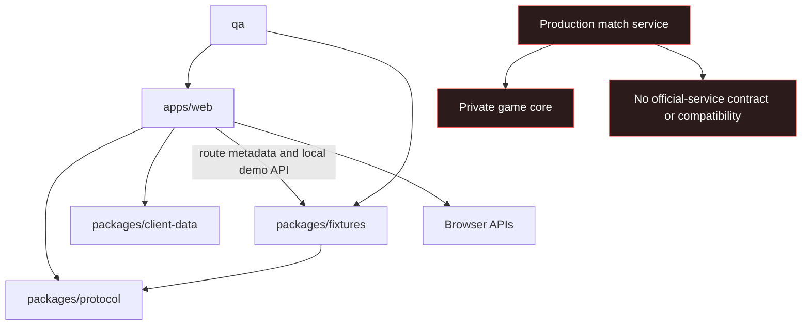

# Architecture

## Purpose

Darkforest Web is a browser-client workspace with a deterministic local demo. Its architecture
enforces a deliberate boundary: enough source, data, fixtures, and verification tooling to
understand and improve the frontend is public, while authoritative game resolution and production
operations remain outside the repository.

## Repository modules

| Path                    | Responsibility                                                                          | Must not contain                                                                   |
| ----------------------- | --------------------------------------------------------------------------------------- | ---------------------------------------------------------------------------------- |
| `apps/web/`             | Fresh/Preact shell, public routes, browser UI, styles, and locales                      | Admin pages, production credentials, private analytics, server-only rules          |
| `packages/protocol/`    | Sanitized public-demo message types and runtime parser                                  | Production service contract, match resolution, databases, secrets                  |
| `packages/client-data/` | Curated values rendered by public-demo presentation pages                               | Authoritative rule source, simulation logic, unpublished design data               |
| `packages/fixtures/`    | Twelve sanitized scenarios and loopback mock                                            | Production replays, player data, operational snapshots                             |
| `qa/`                   | Browser, accessibility, responsive, and contract verification                           | Tests that require production accounts or endpoints                                |
| `scripts/`              | Build, sync, publication, rights, and security checks needed to verify the public scope | Production deployment, admin, content-authoring, or internal-operations automation |
| `docs/`                 | Public architecture, scope, security, privacy, and provenance                           | Private narrative source, handoff notes, internal audits, commercial strategy      |

Public-scope build, test, mock, generation, and verification tools are open source because a
contributor must be able to reproduce and verify the published client. Production operations,
administration, private content-authoring pipelines, deployment control, and internal tools are not
part of that reproducibility boundary and are excluded.

## Dependency direction



Public modules must not import a private monorepo alias, absolute developer path, private package,
production database client, or server-only barrel. Repository checks reject disallowed path classes,
credentials, unsafe network defaults, and other generic boundary violations.

## Local runtime

The default development topology has two processes:

1. `deno task mock` starts a fixture WebSocket service on `127.0.0.1:8788`.
2. `deno task dev` starts the Fresh application on `localhost:8000`.
3. The browser connects to a selected fixture, such as
   `ws://127.0.0.1:8788/ws?fixture=openingMegaCity`.

The mock must bind explicitly to loopback and restrict origins. It is development support, not an
Internet-facing service. The frontend must not silently fall back to `darkforest.tw`, a production
WebSocket host, or any analytics/translation provider.

## Client contract boundary

`packages/protocol` is the single public source for messages shared by the included browser and
local fixture server. It is a standalone public-demo schema and intentionally does not claim
compatibility with the official service. It publishes structures and units needed to reproduce the
demo; it does not publish algorithms that decide an authoritative result. Client-side validation
improves error handling but cannot authorize an action or prevent cheating.

`packages/client-data` is a manually curated disclosure boundary. Only values needed for the
public-demo UI may enter it. The package is not generated from, or drift-checked against, a private
source. Moving a value into client-data is a deliberate publication decision, not a workaround for
importing private rule code.

See [Client contract](CLIENT_CONTRACT.md).

## Fixture boundary

Fixtures are synthetic, deterministic examples. They may demonstrate UI states and protocol
transitions, but they must not contain:

- production replay or account data;
- production service URLs or tokens;
- internal operations metadata;
- excluded narrative, brand, promotional, or third-party content;
- claims that fixture behavior is the authoritative production algorithm.

The mock may implement the minimum state transition needed for UI development. It is not a reference
match server.

## Browser trust boundary

Treat every value from a WebSocket, URL, local storage, fixture, or translation string as untrusted.
Render text through safe DOM APIs, validate protocol envelopes, and reject unexpected origins and
message shapes. Credentials must not be persisted in Web Storage by this public demo.

A production deployment needs additional review for authentication/session storage, Content Security
Policy, framing policy, transport security, cross-origin policy, rate limiting, abuse prevention,
privacy, and server-side authorization.

## Build and generated output

Source files are canonical. Generated browser bundles must be reproducible by public tasks and
checked for drift; client-data remains a reviewed, manually curated source snapshot. A release
should use the committed frozen lockfile and run:

```sh
deno task check
deno task test
deno task build
deno task ci
```

Publication also requires asset, license, dependency, secret, private-path, external-network, and
post-build generated-output gates. A clean clone must pass without access to a private repository.

## Extending the architecture

A change belongs here when an independent contributor can understand, test, and use it without
private credentials or private source, and when publishing it does not expose operational, personal,
contractual, or rights-restricted information. Otherwise, document the interface and keep the
implementation outside this repository.
